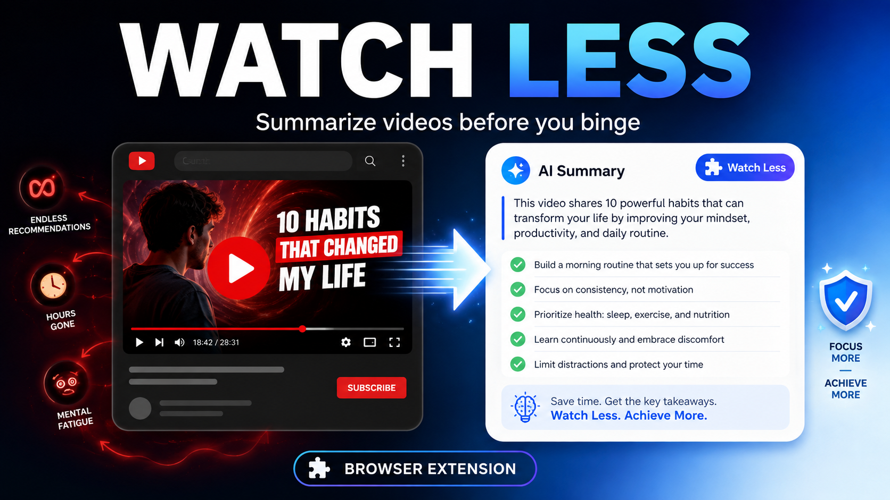

# Watch Less



Watch Less is a small Chrome extension that intercepts YouTube videos and sends the video URL to Gemini with an editable summarisation prompt, helping you read the substance of a video instead of automatically watching it.

## Features

- Intercepts normal YouTube video and Shorts clicks before the video page loads.
- Redirects the same tab to Gemini.
- Inserts an editable prompt and attempts to submit it automatically.
- Stores prompt/settings in browser sync storage.
- Optionally hides YouTube video blocks embedded in Gemini responses.
- No backend, API key, analytics, or telemetry.
- Minimal Chrome permission footprint: only `storage`.

## Install locally

1. Clone or download this repository.
2. Open `chrome://extensions` in Chrome.
3. Enable **Developer mode**.
4. Click **Load unpacked**.
5. Select the repository folder.
6. Make sure you are signed in to Gemini in Chrome.

After updating the source, click **Reload** on the extension card and refresh open YouTube/Gemini tabs.

## How it works

On YouTube, a capture-phase click listener recognises video/Short links and stops YouTube's SPA navigation before the video page starts loading. It creates the configured Gemini prompt and stores it temporarily for the current tab. The extension then navigates that tab to Gemini.

On Gemini, a content script finds the prompt composer, inserts the pending prompt, and attempts to press Send. If Gemini's UI changes and automation cannot complete, the extension displays a fallback message instead of failing silently.

## Settings

Use the extension popup or the full Options page.

The prompt supports:

- `{{VIDEO_URL}}` — intercepted YouTube URL (recommended)
- `{{VIDEO_TITLE}}` — best-effort title from YouTube
- `{{CHANNEL_NAME}}` — best-effort channel name from YouTube

Default prompt:

```text
Analyse this video:

{{VIDEO_URL}}

Provide a clear, concise summary of the video. Cover:
- The main points, arguments, explanations, and conclusions
- Important context, examples, evidence, or nuances needed to understand them
- Any notable claims or details that materially affect the video's message

Prioritise accurately capturing what the video says. Do not include timestamps. Keep the response well-structured and substantially shorter than watching the video.
```

## Privacy

Watch Less has no developer-operated backend and does not collect analytics or telemetry. Settings are stored with `chrome.storage.sync`, while a pending prompt is temporarily stored in `chrome.storage.local` during the YouTube → Gemini handoff. See [PRIVACY.md](PRIVACY.md).

## Permissions

The extension requests only Chrome's `storage` permission. Content scripts are scoped to YouTube and Gemini URLs declared in the manifest.

## Maintenance caveat

Gemini's composer and response-card DOM are private implementation details, not a public extension API. Google can change them at any time. The extension uses defensive selector heuristics, but `gemini.js` is the most likely file to need updates after a Gemini redesign.

## Development

The project intentionally has no build step or package manager. Edit the HTML/CSS/JS files directly and reload the unpacked extension.

See [CONTRIBUTING.md](CONTRIBUTING.md) for contribution guidance.

## Disclaimer

Watch Less is an independent open-source project. It is not affiliated with, endorsed by, or sponsored by Google, YouTube, or Gemini. Product names and trademarks belong to their respective owners.

## License

MIT — see [LICENSE](LICENSE).
